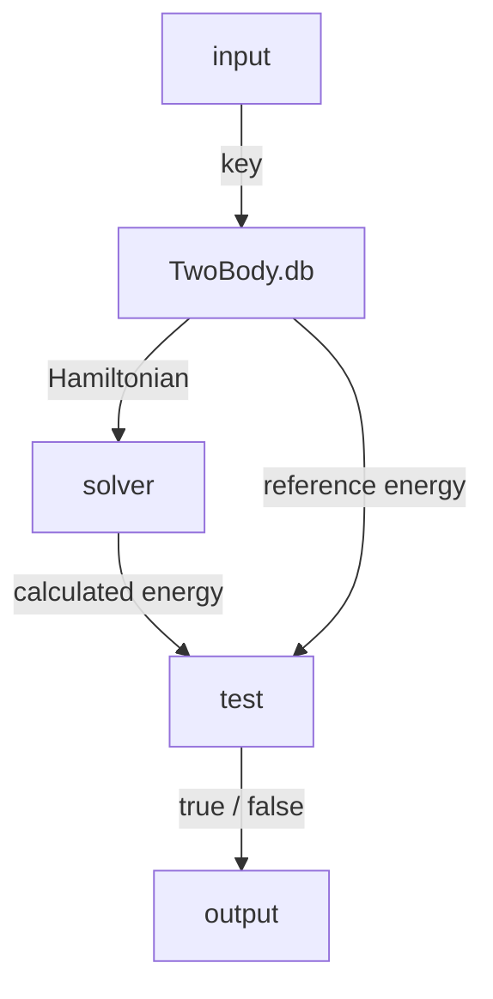

```@meta
CurrentModule = TwoBody
```

# Database

The internal database provides benchmark Hamiltonians and their reference
energies for developing and testing solvers. Database functionality is not
exported because it is intended for package development.

```julia-repl
julia> entry = TwoBody.db(:hydrogen)

julia> entry.hamiltonian

julia> entry.energy
```

The returned Hamiltonian can be passed to a solver, and the calculated energy
can then be compared with the reference value.



## Available data

The proof of concept contains three problems in atomic units:

| Key | System | Reference energy |
|:--|:--|--:|
| `:hydrogen` | Hydrogen ground state | `-0.5` |
| `:positronium` | Positronium ground state | `-0.25` |
| `:harmonic_oscillator` | Three-dimensional harmonic oscillator ground state | `1.5` |

Use `TwoBody.dbkeys()` to obtain the available keys programmatically. Both
symbols and strings are accepted by `TwoBody.db`.

## Adding data

Use the internal `TwoBody.put!` function to register a key, Hamiltonian, and real
reference energy. Duplicate keys are rejected.

```julia
TwoBody.put!(
    :example,
    Hamiltonian(
        NonRelativisticKinetic(ℏ = 1.0, m = 1.0),
        CoulombPotential(coefficient = -1.0),
    ),
    -0.5,
)
```

Registration and lookup both copy the Hamiltonian so that modifying a returned
entry does not alter the stored benchmark.

## API

```@docs
TwoBody.DatabaseEntry
TwoBody.put!
TwoBody.db
TwoBody.dbkeys
```
