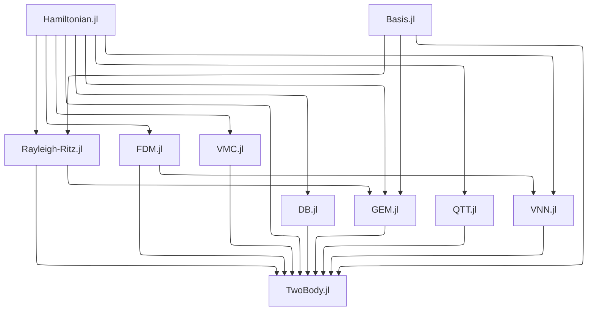

# [Developer Guide](@id developer-guide)

If you are planning significant changes, please open an [issue](https://github.com/JuliaFewBody/TwoBody.jl/issues) first. The [ColPrac](https://github.com/SciML/ColPrac) guidelines are recommended. For Julia package development basics, see:

- [How to develop a Julia package](https://julialang.org/contribute/developing_package/)
- [Pkg: Creating packages](https://pkgdocs.julialang.org/v1/creating-packages/)

## Local Setup

This procedure is required only once. Install Git and Julia on your local machine before starting.

1. Fork [the repository](https://github.com/JuliaFewBody/TwoBody.jl) on GitHub.
2. Clone the forked repository. Replace `xxxxxx` with your GitHub username.

   ```sh
   git clone https://github.com/xxxxxx/TwoBody.jl.git
   cd TwoBody.jl
   ```

3. Install [Revise.jl](https://github.com/timholy/Revise.jl).

   ```sh
   julia --startup-file=no -e 'import Pkg; Pkg.add("Revise")'
   ```

## Development Flow

This is the typical workflow for making changes.

1. Create a branch for your changes. Replace `xxx` with the issue number, for example `issue/20`.

   ```sh
   git switch -c issue/xxx
   ```

2. Start an interactive session with [Revise.jl](https://github.com/timholy/Revise.jl).

   ```sh
   julia --startup-file=no -i -e 'using Revise; import Pkg; Pkg.activate("."); using TwoBody'
   ```

3. Change the source code. When adding functions or updating docstrings, refer to [Documenter: Adding docstrings](https://documenter.juliadocs.org/stable/man/guide/#Adding-Some-Docstrings).
4. If you need a new dependency, replace `SomePackage` with its package name and run:

   ```sh
   julia --project=. --startup-file=no -e 'import Pkg; Pkg.add("SomePackage"); Pkg.resolve(); Pkg.instantiate()'
   ```

5. Run the tests. They may take a few minutes.

   ```sh
   julia --project=. --startup-file=no -e 'using Pkg; Pkg.test()'
   ```

6. Build the documentation locally. HTML files are generated in `docs/build/`; open `docs/build/index.html` in a web browser to review them.

   ```sh
   julia --project=docs --startup-file=no -e 'using Pkg; Pkg.develop(PackageSpec(path=pwd())); Pkg.instantiate()'
   julia --project=docs --startup-file=no -e 'include("docs/make.jl")'
   ```

7. After the tests and documentation build succeed, commit and push the changed files.

   ```sh
   git add "path/to/changed/file"
   git commit -m "commit message"
   git push origin issue/xxx
   ```

8. Submit a pull request on GitHub.

## Adding New Operators and Solvers

TwoBody.jl uses Julia's multiple dispatch to keep the physical problem separate from its numerical solution.

### Operators

1. Define the operator in `src/Hamiltonian.jl` as a subtype of `KineticTerm` or `PotentialTerm`.
2. Implement the solver-specific operations required to support it, such as `element`, `matrix`, or local-energy evaluation.
3. Add tests to the corresponding files under `test/`.
4. Add or update the mathematical definition and API documentation under `docs/src/`.

An unsupported operator–solver combination should fail explicitly rather than silently choosing an approximation.

### Solvers

1. Create `src/MethodName.jl` and define the method type and its `solve(hamiltonian::Hamiltonian, method::MethodName; ...)` implementation.
2. Include the source file from `src/TwoBody.jl` after its dependencies.
3. Create `test/MethodName.jl` and include it from `test/runtests.jl`.
4. Create `docs/src/MethodName.md` and add it to the `pages` list in `docs/make.jl`.
5. Run the complete test suite and documentation build as described in [Development Flow](@ref).

## Versioning and Registering (for Maintainers)

This project follows [Semantic Versioning](https://semver.org/). When bumping the version, update `version` in [`Project.toml`](https://github.com/JuliaFewBody/TwoBody.jl/blob/main/Project.toml).

To register a release in the [General](https://github.com/JuliaRegistries/General) registry, use [Registrator](https://github.com/JuliaRegistries/Registrator.jl#via-the-github-app) through its GitHub App workflow.

## Architecture

`src/TwoBody.jl` defines the `TwoBody` module and includes the source files in dependency order. `Hamiltonian.jl` defines the shared problem representation. `Basis.jl` supports Rayleigh–Ritz and GEM, and `FDM.jl` supplies the discretization used by the variational neural-network method. The solver files extend `solve` for their respective method types.


